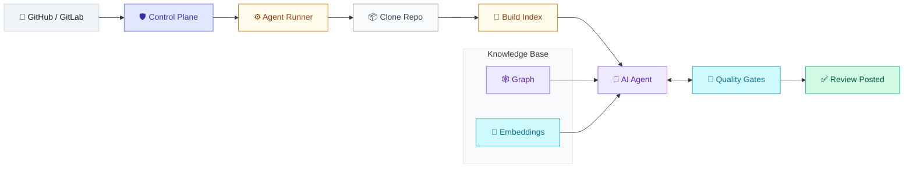

# Lightbridge Code Intelligence Integrations

[Lightbridge Code Intelligence](https://github.com/vymalo/lightbridge-code-intelligence) is an AI-powered code review system that provides deep, repository-aware analysis of pull requests. It combines structural understanding (knowledge graphs) with semantic intelligence (vector embeddings) to deliver comprehensive, hallucination-free code reviews that integrate seamlessly into your development workflow.

## Available Guides

| Guide | What it covers |
|-------|---------------|
| [Overview](00-overview.md) | System architecture, core technologies, and quality gates |
| [GitHub Integration](01-github-integration.md) | GitHub App setup, webhook configuration, and PR review workflow |
| [GitLab Integration](02-gitlab-integration.md) | GitLab integration, webhook setup, and review posting |
| [Local Setup](03-local-setup.md) | Development environment setup and configuration |

## Common Prerequisites

### Install Lightbridge Code Intelligence

```bash
# Clone the repository
git clone https://github.com/vymalo/lightbridge-code-intelligence.git
cd lightbridge-code-intelligence

# Install dependencies
pnpm install

# Run locally
pnpm dev
```

### Configure GitHub App

1. Go to [GitHub App Settings](https://github.com/settings/apps)
2. Create a new GitHub App with:
   - **Repository permissions**: Read and write for pull requests
   - **Webhook**: Enable webhooks for `pull_request` events
   - **Secret**: Generate a webhook secret
3. Install the app to your repositories
4. Note the App ID and installation ID

### Configure GitLab Integration

1. Go to [GitLab Settings](https://gitlab.com/-/settings/integrations)
2. Create a webhook with:
   - **Trigger events**: Push, Merge request events
   - **Secret**: Generate a webhook secret
3. Note the webhook URL and secret

## Governance Note

Lightbridge Code Intelligence usage is subject to the [AI Working Agreement](../../12-ai-working-agreement.md). All AI-generated output must be human-verified before merging. Declare AI usage in your PR using the [PR template](../../04-pull-request-template.md).

## Key Features

- **Two-tier review strategy**: Fast automatic reviews (≤2 min) and deep on-demand reviews
- **Dual indexing**: Structural knowledge graph (Neo4j) + semantic embeddings (pgvector)
- **Quality gates**: Coverage, refute pass, and diff alignment to prevent hallucinations
- **Isolated execution**: Each review runs in an ephemeral Kubernetes Job
- **Single egress point**: Only the control plane talks to GitHub/GitLab

## Architecture Overview



## Core Technologies

- **Syntax Trees**: Hierarchical representation of code structure (AST)
- **Tree-sitter**: Incremental parser for partial/malformed code
- **Knowledge Graph**: Graph database (Neo4j) for structural relationships
- **Vector Embeddings**: Semantic search using high-dimensional vectors

## Quality Gates

1. **Coverage Gate**: Ensures every changed file is reviewed
2. **Refute Pass**: Requires AI to challenge its own assumptions
3. **Diff Alignment**: Validates comments anchor to actual changes

## Documentation

For more detailed information about Lightbridge Code Intelligence, see:
- [Lightbridge Code Intelligence Overview](https://github.com/vymalo/lightbridge-code-intelligence/blob/main/docs/lightbridge-code-intelligence-overview.md)
- [Documentation Index](https://github.com/vymalo/lightbridge-code-intelligence/blob/main/docs/INDEX.md)
- [Architecture Overview](https://github.com/vymalo/lightbridge-code-intelligence/blob/main/docs/architecture.md)
- [Review Pipeline](https://github.com/vymalo/lightbridge-code-intelligence/blob/main/docs/review-pipeline.md)